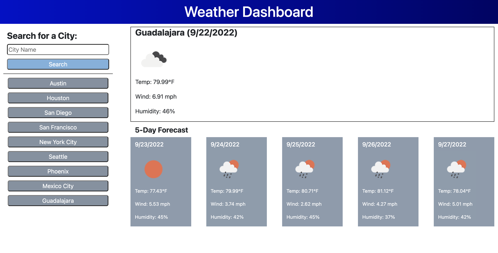

# weather-dashboard

## Description/Purpose
An application that allows users to search the weather for a given city. The app displays a city's temperature, wind, and humidity data. The app also displays a 5-day forecast for the given city. User input saves to local storage. 

## Built with 
* HTML
* CSS
* JavaScript
* jQuery
* Boostrap
* Moment.js

## Acceptance Criteria
```
GIVEN a weather dashboard with form inputs
WHEN I search for a city
THEN I am presented with current and future conditions for that city and that city is added to the search history
WHEN I view current weather conditions for that city
THEN I am presented with the city name, the date, an icon representation of weather conditions, the temperature, the humidity, and the wind speed
WHEN I view future weather conditions for that city
THEN I am presented with a 5-day forecast that displays the date, an icon representation of weather conditions, the temperature, the wind speed, and the humidity
WHEN I click on a city in the search history
THEN I am again presented with current and future conditions for that city
```

## Screenshot


## Deployed Site
[Weather Dashboard](https://fdeaquino.github.io/weather-dashboard/)

## Contribution
Made with ❤️ by Fidel Deaquino